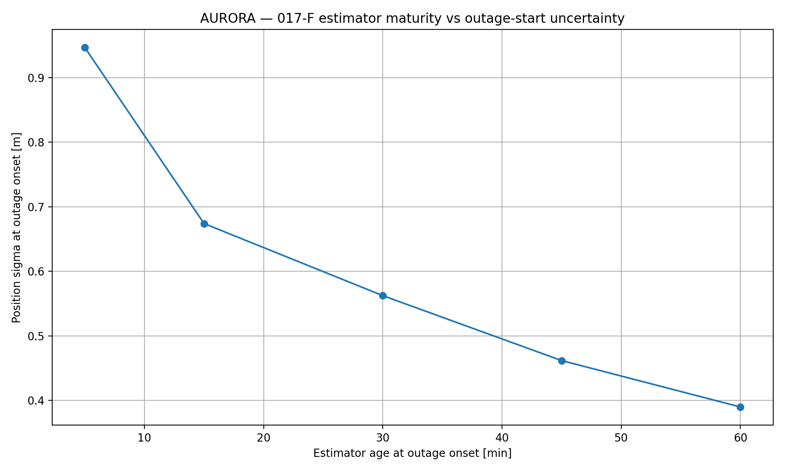
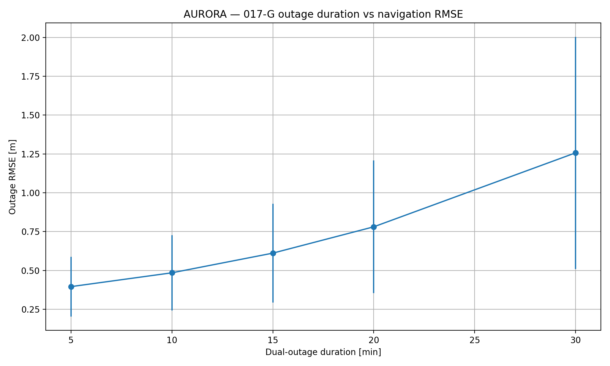
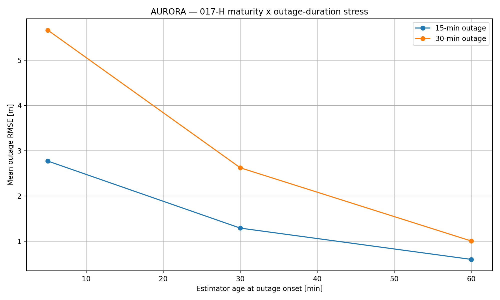
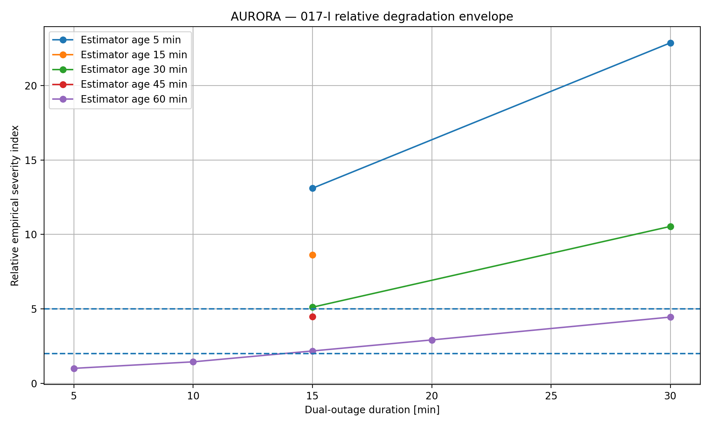
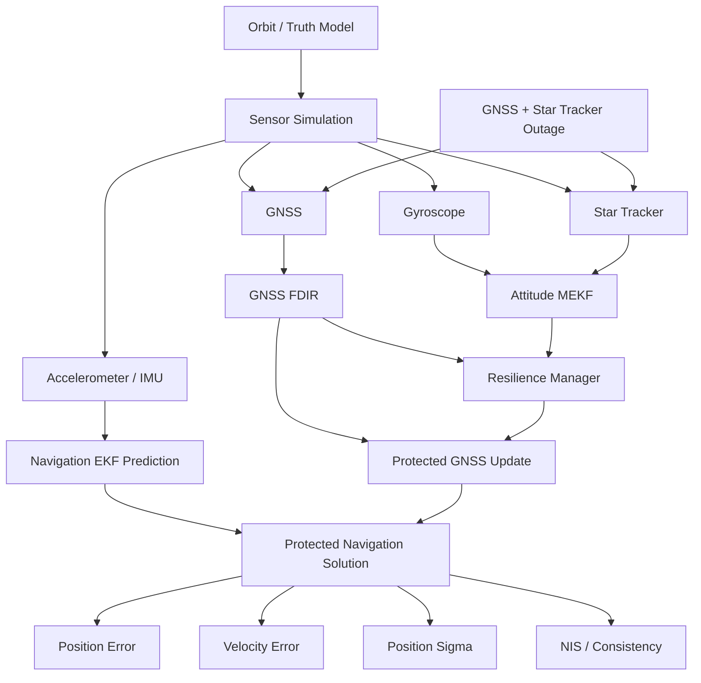
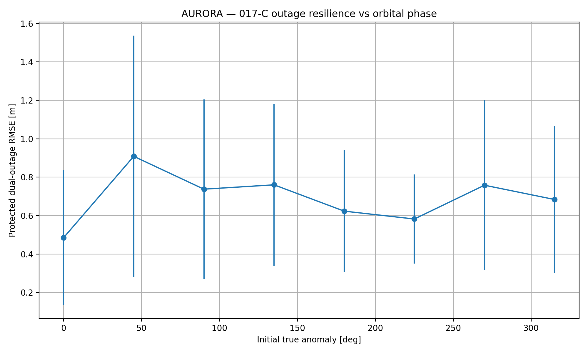
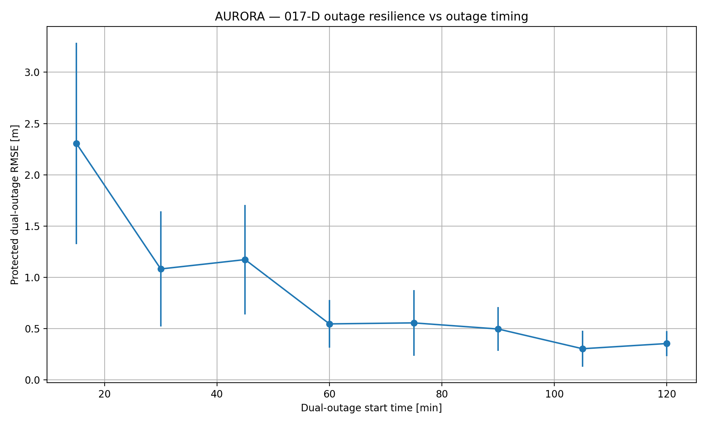
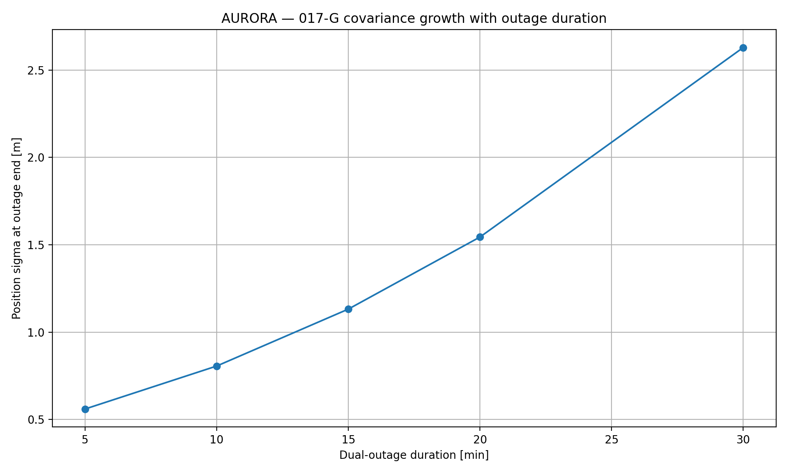

<h1 align="center">🛰️ AURORA</h1>

<h3 align="center">
Autonomous Uncertainty-aware Resilient Orbital Reconfiguration Architecture for Navigation
</h3>

<p align="center">
  <b>Resilient Spacecraft Navigation • Sensor-Outage Analysis • Estimator Maturity • Fault-Tolerant Autonomy</b>
</p>

<p align="center">
  <i>Built to navigate. Tested under sensor loss. Designed to understand why resilience fails.</i>
</p>

<p align="center">
  <code>Python</code>
  &nbsp;•&nbsp;
  <code>Scientific Computing</code>
  &nbsp;•&nbsp;
  <code>Spacecraft Navigation</code>
  &nbsp;•&nbsp;
  <code>EKF / MEKF</code>
  &nbsp;•&nbsp;
  <code>FDIR</code>
  &nbsp;•&nbsp;
  <code>Monte Carlo Validation</code>
</p>

---

<p align="center">
AURORA is a simulation-based spacecraft navigation research platform integrating
<b>orbital dynamics</b>, <b>GNSS navigation</b>, <b>inertial propagation</b>,
<b>attitude estimation</b>, <b>fault detection and isolation</b>,
<b>resilience management</b>, and <b>controlled Monte Carlo experimentation</b>.
</p>

---

# 🎥 Research Highlights

## 🧪 Controlled Estimator-Maturity Experiment

A central result of AURORA is that the same physical sensor outage can produce very different navigation errors depending on how mature the navigation estimator is when the outage begins.

<p align="center">
  
</p>

The physical outage was fixed at:

```text
60–75 min
```

while navigation-estimator age was varied:

```text
5, 15, 30, 45, 60 min
```

Mean outage RMSE decreased from approximately:

```text
4.48 m  →  0.80 m
```

between the youngest and most mature tested estimator conditions.

That corresponds to an approximately:

```text
82% reduction
```

in mean outage RMSE.

---

## ⌛ Outage-Duration Response

With a mature estimator held fixed, the simultaneous GNSS + star-tracker outage was extended from 5 to 30 minutes.

<p align="center">
  
</p>

Longer outages systematically increased:

- navigation RMSE,
- end-of-outage position error,
- estimator covariance.

---

## 🔥 Maturity × Duration Stress Test

Estimator maturity and outage duration were then combined in one controlled stress campaign.

<p align="center">
  
</p>

The navigation penalty produced by a prolonged outage was substantially larger when the estimator was immature.

---

## 🗺️ Empirical Resilience Envelope

The completed Phase 17 experiments were finally combined into an empirical maturity-duration degradation map.

<p align="center">
  
</p>

The resulting LOW / MODERATE / HIGH regions are relative experimental descriptors.

> They are **not** spacecraft certification limits, flight-safety thresholds, or mission acceptance requirements.

---

# 🔬 Research Motivation

Autonomous spacecraft increasingly depend on multiple sensors and estimation systems to maintain accurate knowledge of their state.

Under nominal conditions, GNSS measurements can constrain spacecraft position and velocity while star-tracker observations support precise attitude estimation.

But spacecraft must also remain operational when measurements become temporarily unavailable.

A simultaneous loss of:

```text
GNSS
  +
Star Tracker
```

forces the onboard navigation system to rely more heavily on:

```text
Inertial Propagation
        +
Previously Estimated State
        +
Estimator Covariance
        +
Remaining Sensors
        +
Resilience Logic
```

The key question is therefore not simply:

> **Can the spacecraft continue propagating a navigation solution during sensor loss?**

A more useful research question is:

> **Why are some outages much more damaging than others?**

AURORA investigates this through controlled simulation experiments designed to separate the influence of:

- orbital geometry,
- orbital phase,
- outage timing,
- estimator maturity,
- outage duration,
- combined maturity-duration stress.

---

# 🎯 Research Question

> **What determines the resilience of autonomous spacecraft navigation when GNSS and star-tracker measurements are simultaneously unavailable?**

The Phase 17 research sequence is:

```text
Orbital Geometry
       ↓
Orbital Phase
       ↓
Outage Timing
       ↓
Estimator Maturity
       ↓
Controlled Maturity Intervention
       ↓
Outage Duration
       ↓
Maturity × Duration Stress
       ↓
Empirical Resilience Envelope
```

---

# 🧠 System Architecture



The architecture connects:

```text
Orbital Dynamics
       ↓
Sensor Simulation
       ↓
Navigation + Attitude Estimation
       ↓
Fault Detection
       ↓
Resilience Management
       ↓
Protected Navigation Solution
       ↓
Statistical Validation
```

---

# 🔄 Research Pipeline

```text
Spacecraft Orbit Simulation
            ↓
GNSS Geometry / Visibility
            ↓
GNSS Measurement Simulation
            ↓
Navigation EKF
            ↓
Gyroscope + Star Tracker MEKF
            ↓
Fault Injection
            ↓
GNSS FDIR
            ↓
Resilience State Management
            ↓
Full-Mission Monte Carlo
            ↓
Robustness Campaign
            ↓
Dual-Sensor Outage Research
            ↓
Estimator-Maturity Intervention
            ↓
Outage-Duration Stress Testing
            ↓
Empirical Resilience Envelope
```

---

# 🛰️ Phase 17 — Dual-Sensor Outage Resilience

Phase 17 is the main experimental campaign currently documented in AURORA.

The complete sequence is:

```text
017-A  Orbital GNSS Geometry Sweep
017-B  Representative Orbit Resilience
017-C  Orbital Phase Sweep
017-D  Outage Timing Sweep
017-E  Estimator Maturity Analysis
017-F  Controlled Estimator Maturity
017-G  Outage Duration Sweep
017-H  Maturity × Duration Stress
017-I  Empirical Resilience Envelope
```

The campaign progressively moves from observational evidence toward controlled experiments.

---

# 🌍 017-C — Orbital Phase Sweep

### Research Question

Does initial orbital phase materially change navigation degradation during a fixed simultaneous GNSS + star-tracker outage?

The experiment evaluated:

```text
8 orbital phases
×
8 stochastic replicates
=
64 missions
```

The outage remained fixed at:

```text
60–75 min
```

<p align="center">
  
</p>

### Statistical Result

```text
Friedman statistic = 4.417
p-value            = 0.730727
Kendall's W        = 0.079
```

No statistically significant dependence of outage RMSE on initial orbital phase was detected under the tested configuration.

This does **not** prove orbital phase is universally irrelevant.

It means no statistically significant phase dependence was detected under these specific experimental conditions.

---

# ⏰ 017-D — Outage Timing Sweep

The same 15-minute outage was moved across mission time.

Tested outage starts:

```text
15
30
45
60
75
90
105
120 min
```

with eight paired stochastic replicates per condition.

<p align="center">
  
</p>

### Statistical Result

```text
Friedman statistic = 33.917
p-value            = 0.000018
Kendall's W        = 0.606
```

Outage timing strongly affected navigation degradation.

The best and worst tested conditions differed by approximately:

```text
7.6×
```

in mean outage RMSE.

Approximate values:

```text
15 min start
≈ 2.31 m outage RMSE

105 min start
≈ 0.30 m outage RMSE
```

Pre-outage PDOP did not explain the timing trend.

A much stronger relationship appeared between estimator uncertainty at outage onset and subsequent navigation degradation.

---

# 📈 017-E — Estimator Maturity Analysis

The completed 017-D dataset was re-analyzed without running additional missions.

Estimator uncertainty strongly decreased with mission time:

```text
Mission time → estimator sigma

Spearman ρ = -0.9214
p ≈ 0
```

Mission time also strongly tracked outage degradation:

```text
Mission time → outage RMSE

Spearman ρ = -0.7605
p ≈ 0
```

Estimator uncertainty strongly tracked outage RMSE:

```text
Estimator sigma → outage RMSE

Spearman ρ = 0.7543
p ≈ 0
```

A convergence model was fitted:

```text
sigma(t) = floor + A exp(-t / tau)
```

with approximately:

```text
floor = 0.2573 m
A     = 0.8770 m
tau   = 34.26 min

R² = 0.9837
```

Estimated 90% convergence time:

```text
≈ 78.9 min
```

However, estimator maturity and mission time remained strongly confounded.

The observational evidence therefore supported the estimator-maturity hypothesis but could not establish it independently of mission time.

That motivated a controlled intervention.

---

# 🧪 017-F — Controlled Estimator Maturity

Experiment 017-F deliberately changed navigation-estimator activation time while keeping the physical sensor outage fixed.

Fixed outage:

```text
60–75 min
```

Estimator ages:

```text
5
15
30
45
60 min
```

Eight paired replicates were evaluated at each age:

```text
40 missions total
```

<p align="center">
  
</p>

## Mean Outage RMSE

| Estimator Age | Mean Outage RMSE |
|---:|---:|
| **5 min** | **4.476 m** |
| **15 min** | 2.217 m |
| **30 min** | 1.546 m |
| **45 min** | 1.240 m |
| **60 min** | **0.803 m** |

Mean outage RMSE decreased by approximately:

```text
82%
```

between the 5-minute and 60-minute estimator-age conditions.

### Statistical Result

```text
Outage RMSE

Friedman statistic = 20.9
p-value            = 0.000331
Kendall's W        = 0.653
```

Estimator maturity also significantly affected:

```text
Outage-start uncertainty
End-of-outage error
End-of-outage covariance
Recovery RMSE
```

### Interpretation

The controlled experiment provides evidence that **navigation-estimator maturity materially affects resilience under the same physical dual-sensor outage**.

The intervention changes the maturity of the navigation-estimation / resilience stack rather than covariance alone.

---

# ⌛ 017-G — Outage Duration Sweep

Experiment 017-G held estimator maturity approximately fixed and changed outage duration.

Tested durations:

```text
5
10
15
20
30 min
```

Eight paired replicates were evaluated per duration:

```text
40 missions total
```

## Mean Results

| Outage Duration | Outage RMSE | End Error | End Sigma |
|---:|---:|---:|---:|
| **5 min** | **0.396 m** | **0.458 m** | 0.561 m |
| **10 min** | 0.485 m | 0.659 m | 0.807 m |
| **15 min** | 0.611 m | 0.947 m | 1.132 m |
| **20 min** | 0.781 m | 1.333 m | 1.545 m |
| **30 min** | **1.257 m** | **2.402 m** | **2.629 m** |

<p align="center">
  
</p>

### Estimator Covariance Growth

<p align="center">
  
</p>

### Statistical Result

```text
Outage RMSE

Friedman statistic = 32
p-value            = 0.000002
Kendall's W        = 1.000
```

Longer outages systematically increased:

```text
Outage RMSE
End-of-outage error
End-of-outage covariance
```

Post-recovery RMSE did not show a statistically significant dependence on outage duration within the tested recovery window.

---

# 🔥 017-H — Maturity × Duration Stress Test

Representative estimator ages:

```text
5
30
60 min
```

were combined with:

```text
15
30 min
```

dual-sensor outages.

Total experiment size:

```text
3 estimator ages
×
2 outage durations
×
8 replicates
=
48 missions
```

<p align="center">
  
</p>

## Mean Outage RMSE

| Estimator Age | 15 min outage | 30 min outage |
|---:|---:|---:|
| **5 min** | 2.773 m | **5.667 m** |
| **30 min** | 1.291 m | 2.624 m |
| **60 min** | **0.599 m** | **1.006 m** |

The penalty produced by extending the outage from 15 to 30 minutes was approximately:

```text
5 min estimator age:
+2.894 m RMSE

30 min estimator age:
+1.334 m RMSE

60 min estimator age:
+0.407 m RMSE
```

### Interaction Diagnostic

For outage RMSE:

```text
Friedman statistic = 9
p-value            = 0.011109
Kendall's W        = 0.562
```

The result supports the interpretation that estimator maturity moderates the effect of prolonged sensor loss on navigation RMSE.

A related maturity-dependent effect was also observed for covariance growth.

The terminal-error interaction diagnostic was not statistically significant, so this interaction is not generalized to every metric.

---

# 🗺️ 017-I — Empirical Resilience Envelope

Experiment 017-I required no new spacecraft simulations.

Completed results from:

```text
017-F
017-G
017-H
```

were combined into an empirical maturity-duration degradation envelope.

<p align="center">
  
</p>

Reference condition:

```text
Estimator age:     60 min
Outage duration:    5 min

Outage RMSE:      0.396 m
End error:        0.458 m
```

## Relative Degradation Bands

| Band | Definition |
|---|---:|
| **LOW** | ≤ 2× reference |
| **MODERATE** | > 2× and ≤ 5× reference |
| **HIGH** | > 5× reference |

---

## Lowest Tested Degradation

```text
Estimator age:     60 min
Outage duration:    5 min

Outage RMSE:      0.396 m
End error:        0.458 m
```

---

## Highest Tested Degradation

```text
Estimator age:      5 min
Outage duration:   30 min

Outage RMSE:       5.667 m
End error:        10.482 m
```

Within the tested domain, estimator immaturity can produce a larger degradation penalty than outage duration alone.

> The LOW / MODERATE / HIGH categories are empirical research descriptors only.

---

# 📊 Phase 17 Results at a Glance

| Experiment | Main Variable | Main Finding |
|---|---|---|
| **017-C** | Orbital phase | No statistically significant dependence detected |
| **017-D** | Outage timing | Strong timing dependence |
| **017-E** | Estimator convergence | Strong observational consistency with maturity |
| **017-F** | Estimator maturity | Controlled maturity effect |
| **017-G** | Outage duration | Longer outages increase degradation |
| **017-H** | Maturity × duration | Immaturity amplifies prolonged-outage penalties |
| **017-I** | Combined evidence | Empirical resilience envelope |

---

# 📐 Core Navigation and Resilience Metrics

| Metric | Purpose |
|---|---|
| **Outage Position RMSE** | Navigation accuracy during sensor loss |
| **Outage-Start Error** | Navigation state at outage onset |
| **End-of-Outage Error** | Navigation degradation before reacquisition |
| **Position Sigma** | EKF-estimated navigation uncertainty |
| **Recovery RMSE** | Navigation accuracy after sensor recovery |
| **NIS** | Innovation consistency |
| **PDOP** | GNSS geometry quality |
| **Visible Satellites** | GNSS measurement availability |
| **Attitude Error** | Attitude-estimation performance |

---

# 🧩 Repository Structure

```text
AURORA/
│
├── data/
│   ├── phase15/
│   ├── phase16/
│   └── phase17/
│
├── docs/
│   ├── PHASE17_RESULTS.md
│   ├── REPRODUCIBILITY.md
│   ├── project_definition.md
│   ├── requirements/
│   └── verification/
│
├── experiments/
│   ├── experiment_001b_orbit_validation.py
│   ├── ...
│   ├── experiment_015a_ai_dataset_features.py
│   ├── ...
│   ├── experiment_016d_sensitivity_analysis.py
│   ├── experiment_017a_orbit_gnss_geometry_sweep.py
│   ├── experiment_017b_representative_orbit_resilience.py
│   ├── experiment_017c_dual_outage_phase_sweep.py
│   ├── experiment_017d_outage_timing_sweep.py
│   ├── experiment_017e_estimator_maturity.py
│   ├── experiment_017f_controlled_estimator_maturity.py
│   ├── experiment_017g_outage_duration_sweep.py
│   ├── experiment_017h_combined_stress.py
│   └── experiment_017i_resilience_envelope.py
│
├── results/
│   ├── figures/
│   └── tables/
│
├── simulations/
│
├── src/
│   ├── ai/
│   ├── attitude/
│   ├── dynamics/
│   ├── faults/
│   ├── navigation/
│   ├── sensors/
│   └── validation/
│
├── tests/
│
├── CITATION.cff
├── CONTRIBUTING.md
├── requirements.txt
└── README.md
```

---

# ⚙️ Installation

Clone the repository:

```bash
git clone https://github.com/SabrinaBenghename/Autonomous-Uncertainty-aware-Resilient-Orbital-Reconfiguration-Architecture-for-Navigation.git
```

Enter the project:

```bash
cd Autonomous-Uncertainty-aware-Resilient-Orbital-Reconfiguration-Architecture-for-Navigation
```

Create a virtual environment:

```bash
python -m venv .venv
```

Activate it on Windows:

```powershell
.venv\Scripts\activate
```

Install dependencies:

```bash
pip install -r requirements.txt
```

---

# ▶️ Reproduce the Final Phase 17 Campaign

### Controlled estimator maturity

```bash
python -m experiments.experiment_017f_controlled_estimator_maturity
```

### Outage duration sweep

```bash
python -m experiments.experiment_017g_outage_duration_sweep
```

### Combined maturity × duration stress

```bash
python -m experiments.experiment_017h_combined_stress
```

### Empirical resilience envelope

```bash
python -m experiments.experiment_017i_resilience_envelope
```

Detailed reproducibility information is available in:

```text
docs/REPRODUCIBILITY.md
```

---

# 🧰 Technology Stack

<p align="center">
  <code>Python</code>
  &nbsp;•&nbsp;
  <code>NumPy</code>
  &nbsp;•&nbsp;
  <code>SciPy</code>
  &nbsp;•&nbsp;
  <code>Pandas</code>
  &nbsp;•&nbsp;
  <code>Matplotlib</code>
  &nbsp;•&nbsp;
  <code>EKF</code>
  &nbsp;•&nbsp;
  <code>MEKF</code>
  &nbsp;•&nbsp;
  <code>FDIR</code>
</p>

### Scientific Computing

```text
Python
NumPy
SciPy
Pandas
Matplotlib
```

### Navigation and Estimation

```text
Extended Kalman Filter
Multiplicative Extended Kalman Filter
GNSS Positioning
Inertial Propagation
Quaternion Attitude Estimation
Covariance Analysis
Innovation Consistency Analysis
```

### Spacecraft Simulation

```text
Orbital Dynamics
Orbital Elements
Reference Frames
Perturbation Models
GNSS Constellation Geometry
Sensor Simulation
```

### Resilience

```text
Fault Injection
Fault Detection and Isolation
Sensor Validation
Resilience State Management
Protected Navigation Updates
```

### Experimental Validation

```text
Monte Carlo Simulation
Paired Experimental Designs
Friedman Tests
Wilcoxon Tests
Spearman Correlation
Partial Correlation
Convergence Modelling
Sensitivity Analysis
```

---

# ⚠️ Scientific Scope and Limitations

AURORA is currently a **simulation-based research platform**.

It is not presented as a flight-qualified spacecraft navigation system.

Current limitations include:

- finite Monte Carlo replicate counts,
- finite tested outage-duration range,
- simulator-defined sensor models,
- no hardware-in-the-loop validation yet,
- no mission-specific absolute navigation acceptance threshold,
- no flight-software qualification,
- no spacecraft certification claims,
- the controlled estimator-start intervention also resets associated resilience-manager history,
- the attitude MEKF remains active before navigation-estimator activation during the controlled maturity experiment.

The empirical resilience envelope therefore describes behavior only within the tested experimental domain.

---

# 🔭 Future Research Directions

Potential extensions include:

- hardware-in-the-loop experiments,
- mission-specific integrity requirements,
- expanded outage-duration domains,
- higher-fidelity spacecraft sensor-error models,
- multi-sensor fault combinations,
- adaptive autonomous reconfiguration,
- alternative navigation estimators,
- fault-tolerant sensor fusion,
- formal integrity monitoring,
- flight-software-oriented implementation,
- real-time embedded deployment,
- mission-specific navigation requirements.

---

# 📄 Research Paper

The completed AURORA experimental campaign is being consolidated into a formal research-style report.

Planned structure:

```text
Abstract

1. Introduction

2. Related Work

3. AURORA System Architecture

4. Orbital Dynamics and Sensor Models

5. Navigation Estimation

6. Attitude Estimation

7. FDIR and Resilience Management

8. Experimental Methodology

9. Orbital Geometry Analysis

10. Outage Phase and Timing Analysis

11. Estimator Maturity Mechanism

12. Controlled Maturity Intervention

13. Outage Duration Analysis

14. Combined Maturity × Duration Stress

15. Empirical Resilience Envelope

16. Discussion

17. Limitations

18. Conclusion
```

---

# 🧭 Project Philosophy

AURORA was not developed only to demonstrate that a simulated spacecraft can continue propagating a navigation state during sensor loss.

It was developed to investigate:

> **Why can the same external sensor failure produce dramatically different navigation outcomes?**

The project therefore focuses on three questions:

> **How uncertain is the navigation estimator when the outage begins?**

> **How long must the spacecraft operate without absolute navigation and attitude updates?**

> **How does the estimator's internal state influence the severity of an external sensor failure?**

The completed Phase 17 experiments indicate that resilience is not determined by outage duration alone.

Within the tested experimental domain:

> **Estimator maturity can be as important as — and in some conditions more important than — the duration of sensor loss itself.**

---

# 📚 Citation

Citation metadata is provided in:

```text
CITATION.cff
```

The citation file should contain the final author identity, repository URL, project version, and selected software license before public release.

---

# 📄 License

A final software license has not yet been selected.

Until a license is explicitly added, the repository should not be interpreted as granting unrestricted reuse rights.

---

<h2 align="center">⭐ AURORA</h2>

<h3 align="center">
Autonomous Uncertainty-aware Resilient Orbital Reconfiguration Architecture for Navigation
</h3>

<p align="center">
  <b>Resilient navigation. Controlled degradation. Interpretable autonomy.</b>
</p>

<p align="center">
🛰️
</p>
