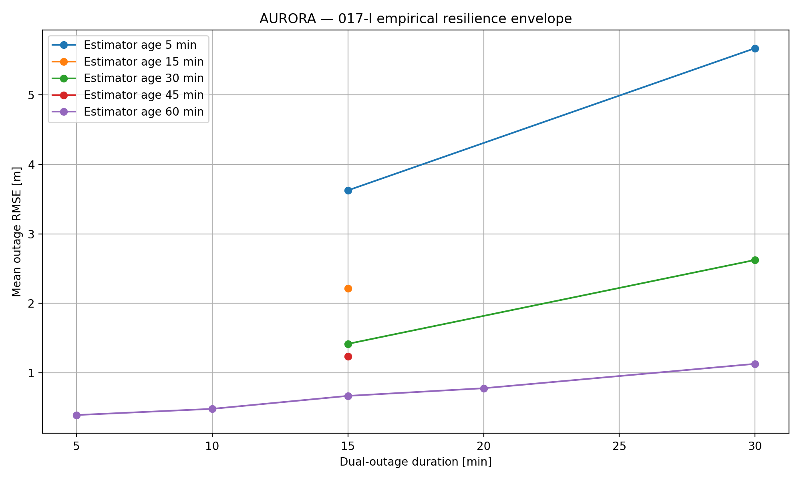
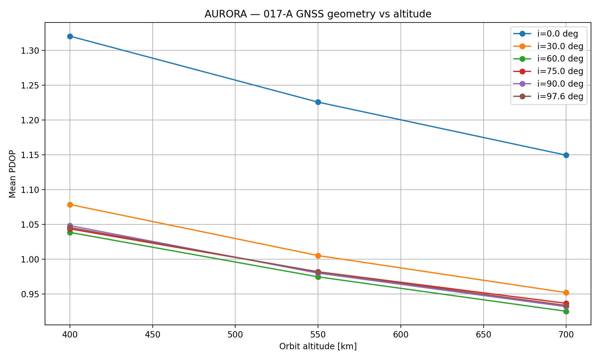

🛰️ AURORA — Autonomous Uncertainty-aware Resilient Orbital Reconfiguration Architecture for Navigation
Resilient Spacecraft Navigation • GNSS / Star-Tracker Outages • Estimator Maturity • Fault-Tolerant Autonomy
Built to navigate. Tested under sensor loss. Designed to remain measurable, interpretable, and resilient.

A simulation-based spacecraft navigation research platform combining orbital dynamics, GNSS navigation, inertial propagation, attitude estimation, fault detection and isolation (FDIR), resilience management, and controlled Monte Carlo experimentation.

🎥 Research Visuals
🧭 Empirical Resilience Envelope
The final Phase 17 experiment combines completed maturity and outage-duration campaigns into a compact empirical degradation map.

  

The envelope is relative to the best tested reference condition and is intended as a descriptive research result — not a certification or mission-safety boundary.

⏱️ Estimator Maturity vs. Dual-Sensor Outage
A central finding of the project is that outage severity depends strongly on the maturity of the navigation estimator when the outage begins.

  

This controlled experiment separates estimator age from mission time and tests how maturity changes resilience under both nominal and prolonged outages.

📉 Outage Duration Response
With a mature estimator held fixed, longer simultaneous GNSS + star-tracker outages produce systematic increases in in-outage navigation error.

  

📡 Orbital GNSS Geometry
The project also evaluates how orbital geometry affects GNSS visibility, dilution of precision, and the navigation conditions preceding resilience events.

  

🔬 Research Motivation
Autonomous spacecraft navigation systems depend on multiple sources of absolute and relative state information.

A navigation architecture that performs well during nominal sensor availability may behave very differently when:

GNSS measurements become unavailable,

star-tracker updates are lost,

the navigation filter is still converging,

the outage occurs early or late in the mission,

the outage lasts longer than expected,

or the estimator enters the outage with elevated uncertainty.

AURORA was developed to study these conditions systematically rather than treating outage resilience as a single yes/no property.

The core idea is to move from “does the system survive an outage?” toward “which internal and external conditions determine how severely navigation degrades during the outage?”

🎯 Research Question
What determines the resilience of autonomous spacecraft navigation when GNSS and star-tracker measurements are simultaneously unavailable?

The completed Phase 17 campaign investigates this question through four linked themes:

Orbital Geometry → Outage Timing → Estimator Maturity → Outage Duration

and concludes with an empirical maturity-duration resilience envelope.

🧠 System Architecture
flowchart TD

    A[Orbit / Truth Model] --> B[Sensor Simulation]

    B --> C[GNSS]
    B --> D[Accelerometer / IMU]
    B --> E[Gyroscope]
    B --> F[Star Tracker]

    C --> G[GNSS FDIR]
    E --> H[Attitude MEKF]
    F --> H

    D --> I[Navigation EKF Prediction]
    G --> J[Protected GNSS Update]

    G --> K[Resilience Manager]
    H --> K

    K --> J
    I --> L[Protected Navigation Solution]
    J --> L

    M[Simultaneous GNSS + Star-Tracker Outage] --> C
    M --> F

    L --> N[Position / Velocity Error]
    L --> O[Covariance / Sigma]
    L --> P[NIS / Consistency Metrics]
The architecture combines state estimation, sensor validation, fault handling, and resilience management into one reproducible simulation framework.

🔄 Research Pipeline
Orbital Dynamics + Sensor Simulation
                ↓
GNSS Geometry / Visibility Analysis
                ↓
Navigation EKF + Attitude MEKF
                ↓
Fault Injection + GNSS FDIR
                ↓
Resilience State Management
                ↓
Monte Carlo Robustness Campaigns
                ↓
Dual-Sensor Outage Experiments
                ↓
Estimator-Maturity Intervention
                ↓
Outage-Duration Sweep
                ↓
Maturity × Duration Stress Test
                ↓
Empirical Resilience Envelope
🛰️ Phase 17 — Dual-Sensor Outage Resilience
Phase 17 is the main research campaign of the current repository.

It studies simultaneous loss of:

GNSS
  +
Star Tracker
while the spacecraft continues propagating its navigation and attitude state using the remaining onboard estimation architecture.

The campaign was intentionally designed as a sequence of increasingly controlled experiments.

017-C — Orbital Phase Sweep
Question: Does the initial orbital phase materially affect navigation degradation during a fixed 15-minute dual-sensor outage?

Result
No statistically significant phase dependence was detected under the tested conditions.

Friedman p = 0.730727
Kendall's W = 0.079
This does not prove orbital phase is universally irrelevant. It means no statistically significant dependence was detected in this specific tested configuration.

017-D — Outage Timing Sweep
Question: Does the mission time at which the outage begins affect resilience?

Result
Yes.

Outage timing produced a strong change in navigation performance:

Friedman p = 0.000018
Kendall's W = 0.606
The best and worst tested outage-start conditions differed by approximately:

7.6× in mean outage RMSE
The timing effect could not be explained by PDOP alone.

A strong relationship appeared between outage-start estimator uncertainty and navigation degradation.

017-E — Estimator Maturity Mechanism Analysis
The completed 017-D timing data were re-analyzed without running new missions.

A convergence model fitted to the pre-outage navigation uncertainty produced:

sigma(t) = floor + A * exp(-t / tau)

floor ≈ 0.257 m
tau   ≈ 34.26 min
R²    ≈ 0.984
Estimator uncertainty strongly decreased with mission time and strongly tracked outage degradation.

However, estimator maturity and mission time remained confounded in the observational data.

This motivated a controlled intervention.

017-F — Controlled Estimator Maturity
The navigation estimator was deliberately activated at different times while the physical outage remained fixed at:

60–75 min
Tested estimator ages:

5, 15, 30, 45, 60 min

  

Main result
Mean outage RMSE decreased from approximately:

4.48 m  →  0.80 m
between the 5-minute and 60-minute estimator-age conditions.

This corresponds to an approximately:

82% reduction
in mean outage RMSE across the tested maturity range.

The omnibus maturity effect was statistically significant:

Friedman p = 0.000331
Kendall's W = 0.653
This experiment provides controlled evidence that navigation-estimator maturity materially affects resilience under a fixed dual-sensor outage.

017-G — Outage Duration Sweep
A mature estimator was held fixed while outage duration was varied:

5, 10, 15, 20, 30 min
Mean outage RMSE
Outage Duration	Mean RMSE
5 min	0.396 m
10 min	0.485 m
15 min	0.611 m
20 min	0.781 m
30 min	1.257 m

  

Longer outages also produced systematic terminal-error and covariance growth.

The duration effect on outage RMSE was statistically significant:

Friedman p = 0.000002
Kendall's W = 1.000
Post-recovery RMSE did not show a statistically significant duration dependence in the tested recovery window.

017-H — Maturity × Duration Stress Test
Representative estimator ages:

5, 30, 60 min
were combined with:

15 min
30 min
dual-sensor outages.

  

Main observation
The penalty associated with a long outage was substantially larger when the navigation estimator was immature.

For outage RMSE, the maturity-dependent duration penalty was statistically significant:

Friedman p = 0.011109
Kendall's W = 0.562
A corresponding interaction diagnostic was also detected for covariance growth.

The terminal-error interaction diagnostic was not statistically significant, so the result is not interpreted as a universal interaction across all metrics.

017-I — Empirical Resilience Envelope
The completed 017-F, 017-G, and 017-H campaigns were combined without running additional missions.

  

The reference condition is:

Estimator age:    60 min
Outage duration:   5 min
Outage RMSE:     0.396 m
End error:       0.458 m
Relative degradation bands:

Band	Definition
🟢 LOW	≤ 2× reference
🟡 MODERATE	> 2× and ≤ 5× reference
🔴 HIGH	> 5× reference
Boundary conditions in the tested domain
Lowest tested degradation

Estimator age:    60 min
Outage duration:   5 min
Outage RMSE:      0.396 m
End error:        0.458 m
Highest tested degradation

Estimator age:     5 min
Outage duration:  30 min
Outage RMSE:      5.667 m
End error:       10.482 m
These bands are empirical research descriptors only. They are not flight-safety thresholds, certification limits, or mission acceptance criteria.

📊 Phase 17 Results at a Glance
Experiment	Main Variable	Key Finding
017-C	Orbital phase	No statistically significant dependence detected
017-D	Outage start time	Strong timing dependence
017-E	Estimator convergence	Strong observational consistency with maturity mechanism
017-F	Estimator age	Controlled maturity effect on resilience
017-G	Outage duration	Longer outages increase degradation
017-H	Maturity × duration	Immaturity amplifies long-outage RMSE and covariance penalties
017-I	Combined evidence	Empirical resilience envelope
📐 Core Metrics
AURORA evaluates resilience through complementary navigation, estimation, geometry, and recovery metrics:

Metric	Purpose
Outage Position RMSE	Navigation accuracy during sensor loss
End-of-Outage Error	Terminal degradation at reacquisition
Position Sigma	Estimated navigation uncertainty
Recovery RMSE	Post-outage recovery quality
NIS	Innovation consistency
PDOP	GNSS geometry quality
Visible Satellites	Measurement availability
Attitude Error	MEKF attitude-estimation quality
🧩 Repository Structure
AURORA/
├── data/
│   ├── phase15/
│   ├── phase16/
│   └── phase17/
│
├── docs/
│   ├── PHASE17_RESULTS.md
│   ├── REPRODUCIBILITY.md
│   ├── requirements/
│   └── verification/
│
├── experiments/
│   ├── experiment_001b_orbit_validation.py
│   ├── ...
│   ├── experiment_017f_controlled_estimator_maturity.py
│   ├── experiment_017g_outage_duration_sweep.py
│   ├── experiment_017h_combined_stress.py
│   └── experiment_017i_resilience_envelope.py
│
├── results/
│   ├── figures/
│   └── tables/
│
├── src/
│   ├── ai/
│   ├── attitude/
│   ├── dynamics/
│   ├── faults/
│   ├── navigation/
│   ├── sensors/
│   └── validation/
│
├── tests/
├── CITATION.cff
├── CONTRIBUTING.md
├── requirements.txt
└── README.md
⚙️ Installation
Clone the repository:

git clone https://github.com/SabrinaBenghename/Autonomous-Uncertainty-aware-Resilient-Orbital-Reconfiguration-Architecture-for-Navigation.git
Enter the repository:

cd Autonomous-Uncertainty-aware-Resilient-Orbital-Reconfiguration-Architecture-for-Navigation
Create a virtual environment:

python -m venv .venv
On Windows:

.venv\Scripts\activate
Install dependencies:

pip install -r requirements.txt
▶️ Reproduce the Final Research Campaign
Run the controlled estimator-maturity experiment:

python -m experiments.experiment_017f_controlled_estimator_maturity
Run the outage-duration sweep:

python -m experiments.experiment_017g_outage_duration_sweep
Run the combined stress experiment:

python -m experiments.experiment_017h_combined_stress
Build the empirical resilience envelope:

python -m experiments.experiment_017i_resilience_envelope
Detailed reproducibility notes are provided in:

docs/REPRODUCIBILITY.md
🧰 Technology Stack

Core technologies

Python

NumPy

SciPy

Pandas

Matplotlib

Extended Kalman Filtering

Multiplicative EKF attitude estimation

Orbital dynamics

GNSS simulation

Fault detection and isolation

Monte Carlo experimentation

Statistical hypothesis testing

⚠️ Scientific Scope and Limitations
AURORA is a simulation-based research platform, not a flight-qualified navigation system.

Current limitations include:

finite Monte Carlo replicate counts,

a finite tested outage-duration domain,

no hardware-in-the-loop validation,

no mission-specific absolute navigation acceptance threshold,

no flight-software certification,

simulator-defined GNSS, IMU, gyro, and star-tracker models,

the controlled estimator-start intervention also resets associated resilience-manager history,

the attitude MEKF remains active before navigation-estimator activation in the controlled maturity experiment.

These limitations are retained explicitly in the interpretation of the results.

🔭 Future Research Directions
Potential extensions include:

hardware-in-the-loop testing,

mission-specific integrity requirements,

wider outage-duration domains,

more detailed spacecraft sensor-error models,

autonomous reconfiguration policies,

multi-sensor fault combinations,

flight-software-oriented implementation,

comparison with alternative estimators,

formal integrity and availability analysis.

📄 Research Paper
The current GitHub repository is being consolidated into a research-style report based on the completed experimental evidence.

Planned sections include:

Abstract
Introduction
Related Work
AURORA System Architecture
Orbital and Sensor Models
Navigation and Attitude Estimation
FDIR and Resilience Management
Experimental Methodology
Phase 17A–E Observational Analysis
Phase 17F Controlled Maturity Intervention
Phase 17G Outage-Duration Sweep
Phase 17H Combined Stress Experiment
Phase 17I Empirical Resilience Envelope
Discussion
Limitations
Conclusion
🧭 Project Philosophy
AURORA was not built only to demonstrate that a simulated spacecraft can continue propagating a state estimate during sensor loss.

It was built to investigate why some outages are much more damaging than others.

The project therefore focuses on three questions:

How uncertain is the estimator when the outage begins?

How long must the system operate without absolute navigation and attitude updates?

How does that internal estimator state change the severity of the same external sensor failure?

The completed Phase 17 campaign suggests that resilience is not determined by outage duration alone.

Within the tested domain, estimator maturity can be as important as — and in some cases more important than — the duration of sensor loss itself.

⭐ AURORA
Resilient navigation. Controlled degradation. Interpretable autonomy.
