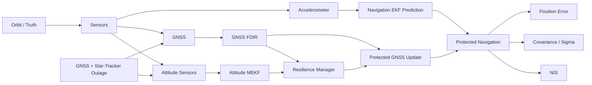

# AURORA

**Autonomous resilient spacecraft navigation under simultaneous GNSS and star-tracker outages**

AURORA is a simulation-driven research project for autonomous spacecraft navigation, fault resilience, and estimator robustness. The project combines orbital dynamics, GNSS-based navigation, inertial propagation, attitude estimation, fault detection/isolation, and resilience management.

The completed Phase 17 campaign investigates how outage resilience changes with:

- orbital phase,
- outage timing,
- navigation-estimator maturity,
- outage duration,
- and combined maturity × duration stress.

## Main result

The Phase 17 evidence identifies **navigation-estimator maturity** and **outage duration** as major drivers of outage vulnerability in the tested AURORA configuration.

Under the same fixed 60–75 min simultaneous GNSS/star-tracker outage, mean navigation RMSE decreased from approximately **4.48 m** with a 5-min-old estimator to approximately **0.80 m** with a 60-min-old estimator.

For a mature estimator, extending the outage from 5 to 30 min increased mean outage RMSE from approximately **0.40 m** to **1.26 m**, while mean end-of-outage error increased from approximately **0.46 m** to **2.40 m**.

## Phase 17 experiment chain

| ID | Experiment | Main finding |
|---|---|---|
| 017-C | Orbital-phase sweep | No statistically significant phase dependence detected |
| 017-D | Outage-timing sweep | Strong timing dependence |
| 017-E | Estimator-maturity mechanism analysis | Strongly consistent with convergence, but time and uncertainty were confounded |
| 017-F | Controlled estimator-maturity intervention | Maturity significantly affects outage resilience |
| 017-G | Outage-duration sweep | Longer outages produce systematic degradation |
| 017-H | Maturity × duration stress | Long outages penalize immature estimators more strongly |
| 017-I | Empirical resilience envelope | Relative degradation map built from completed experiments |

## Architecture



## Repository layout

```text
AURORA/
├── experiments/          # Experiment drivers
├── src/                  # Dynamics, navigation, FDIR, AI, validation
├── docs/                 # Research notes and reproducibility documentation
├── results/
│   ├── figures/          # Selected publication-quality figures
│   └── tables/           # Selected summary/statistics tables
├── data/                 # Small reproducibility inputs only
├── requirements.txt
├── CITATION.cff
└── README.md
```

## Reproduce Phase 17

Run from the repository root:

```powershell
python -m experiments.experiment_017f_controlled_estimator_maturity
python -m experiments.experiment_017g_outage_duration_sweep
python -m experiments.experiment_017h_combined_stress
python -m experiments.experiment_017i_resilience_envelope
```

Experiments 017-F/G/H are checkpoint-safe and should not rerun completed condition/replicate pairs when their result CSV already exists.

See [docs/REPRODUCIBILITY.md](docs/REPRODUCIBILITY.md) for the complete workflow.

## Phase 17 results

See [docs/PHASE17_RESULTS.md](docs/PHASE17_RESULTS.md).

The final empirical envelope uses the mature-estimator 5-min outage as a **relative reference condition**. The low/moderate/high degradation bands are descriptive project-level bands and **not spacecraft certification or mission-safety limits**.

## Current status

**Phase 17: complete and validated.**

Next project stage:

1. freeze repository structure,
2. select final figures and tables,
3. prepare the LaTeX research report,
4. prepare the PFE/lab presentation,
5. optionally extend toward hardware-in-the-loop validation or mission-specific integrity requirements.

## Citation

If you use this repository, please cite it using the metadata in [`CITATION.cff`](CITATION.cff).

## License

A license has not yet been selected. Choose one before public release if you intend others to reuse the code.
